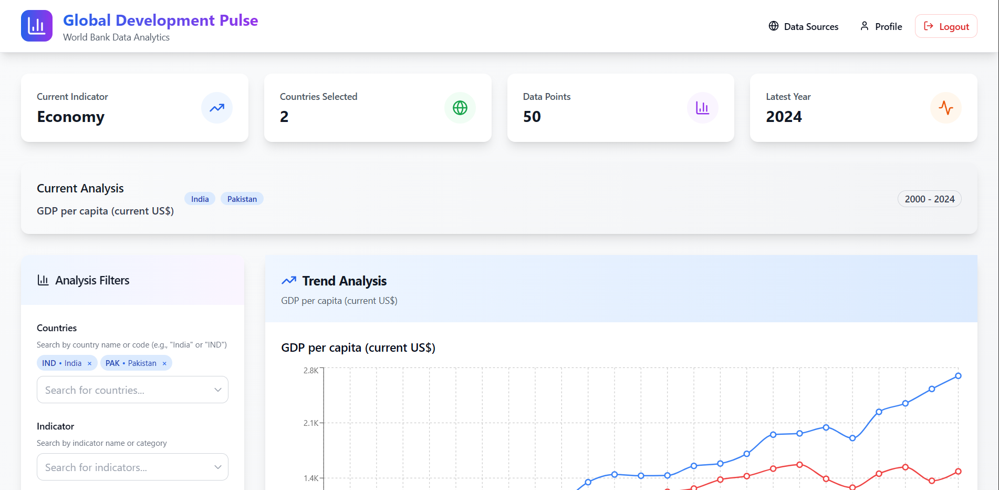
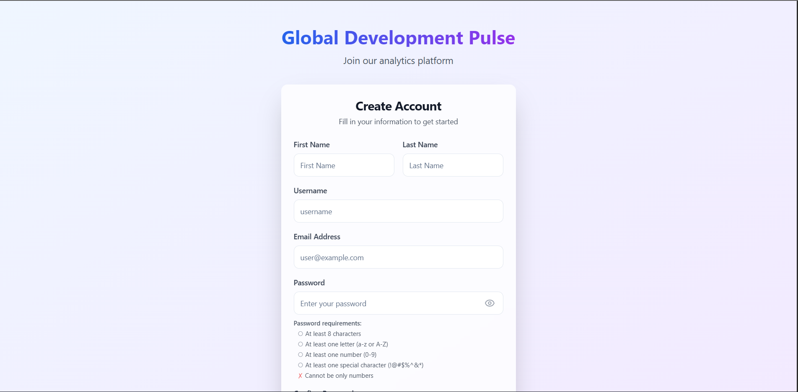
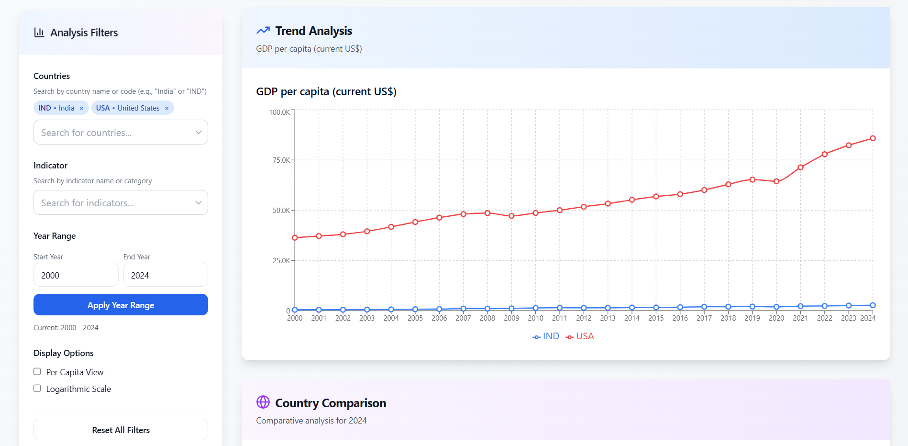

# Global Development Pulse 🌍

A comprehensive full-stack web application that transforms World Bank development indicators into interactive visualizations. Built with modern technologies including React, TypeScript, Django, and MongoDB, featuring real-time data fetching, user authentication, and responsive design.


## 📸 Screenshots

<div align="center">

### Dashboard Overview


_Interactive dashboard with country selection and indicator filters_

### Signup & Authentication


_Secure user authentication with JWT tokens_

### Chart Visualizations


_Multiple chart types with responsive design_


</div>

## 🌟 Key Features

### 🎯 Core Functionality

- **Interactive Dashboard**: Rich visualizations of global development indicators
- **Real-time Data**: Direct integration with World Bank Open Data API
- **User Authentication**: Secure JWT-based login/registration system
- **Responsive Design**: Optimized for desktop, tablet, and mobile devices
- **Data Export**: Export charts as PNG and data as CSV/JSON
- **URL State Management**: Shareable URLs with persistent filter states

### 📊 Advanced Analytics

- **Multiple Chart Types**: Line charts for trends, bar charts for comparisons
- **Smart Filtering**: Multi-country selection, date ranges, per-capita toggles
- **Scale Options**: Linear and logarithmic scale support
- **Interactive Elements**: Zoom, pan, hover tooltips, and data point selection
- **Comparison Tools**: Side-by-side country and indicator analysis

### ⚡ Performance & Reliability

- **Multi-layer Caching**: Redis + MongoDB caching for optimal performance
- **Error Recovery**: Comprehensive error handling with retry mechanisms
- **Rate Limiting**: API throttling and request optimization
- **Offline Support**: Cached data availability when API is unavailable
- **Real-time Updates**: Automatic data refresh and background sync

## 🏗️ Architecture Overview

```
┌─────────────────┐    ┌─────────────────┐    ┌─────────────────┐
│                 │    │                 │    │                 │
│   React Frontend│◄──►│ Django Backend  │◄──►│ World Bank API  │
│   (TypeScript)  │    │   (Python)      │    │                 │
│                 │    │                 │    │                 │
└─────────────────┘    └─────────────────┘    └─────────────────┘
         │                       │
         │                       ▼
         │              ┌─────────────────┐
         │              │                 │
         └──────────────┤   MongoDB +     │
                        │   Redis Cache   │
                        │                 │
                        └─────────────────┘
```

## 🛠️ Technology Stack

### Frontend (`/frontend`)

| Technology          | Purpose                 |
| ------------------- | ----------------------- |
| **React**           | UI Framework            |
| **TypeScript**      | Type Safety             |
| **Vite**            | Build Tool & Dev Server |
| **TailwindCSS**     | Styling & Design System |
| **React Query**     | Data Fetching & Caching |
| **React Hook Form** | Form Management         |
| **Recharts**        | Chart Visualizations    |
| **Zustand**         | State Management        |
| **React Router**    | Client-side Routing     |

### Backend (`/backend`)

| Technology                | Purpose          |
| ------------------------- | ---------------- |
| **Django**                | Web Framework    |
| **Django REST Framework** | API Development  |
| **MongoDB**               | Primary Database |
| **Redis**                 | Caching Layer    |
| **Gunicorn**              | WSGI Server      |
| **JWT**                   | Authentication   |
| **Requests**              | HTTP Client      |

### DevOps & Deployment

- **Render** for production hosting
- **MongoDB Atlas** for managed database
- **GitHub Actions** for CI/CD

## 🚀 Quick Start

### Prerequisites

- **Node.js** 18+ and npm
- **Python** 3.11+
- **Git**
- **Docker** (optional, for containerized setup)

### Option 1: Development Setup (Recommended)

#### 1. Clone the Repository

```bash
git clone https://github.com/pkparthk/Global-Development-Pulse.git
cd Global-Development-Pulse
```

#### 2. Backend Setup

```bash
cd backend

# Create virtual environment
python -m venv .venv

# Activate virtual environment
# Windows:
.venv\Scripts\activate
# macOS/Linux:
source .venv/bin/activate

# Install dependencies
pip install -r requirements.txt

# Run database migrations
python manage.py migrate


# Start development server
python manage.py runserver
```

#### 3. Frontend Setup

```bash
# In a new terminal
cd frontend

# Install dependencies
npm install

# Create environment file
cp .env.example .env  # Edit with your settings

# Start development server
npm run dev
```

#### 4. Access the Application

- **Frontend**: http://localhost:3000
- **Backend API**: http://localhost:8000
- **API Documentation**: http://localhost:8000/api/docs/


## 📁 Project Structure

```
Global-Development-Pulse/
├── 📁 frontend/                 # React TypeScript frontend
│   ├── 📁 src/
│   │   ├── 📁 components/       # Reusable UI components
│   │   ├── 📁 pages/           # Route-level pages
│   │   ├── 📁 services/        # API services & queries
│   │   ├── 📁 store/           # State management
│   │   ├── 📁 types/           # TypeScript definitions
│   │   └── 📁 utils/           # Helper functions
│   ├── 📄 package.json
│   ├── 📄 vite.config.ts
│   └── 📄 tailwind.config.js
├── 📁 backend/                  # Django Python backend
│   ├── 📁 api/                 # Main API application
│   │   ├── 📁 services/        # External API integrations
│   │   ├── 📄 models.py        # Database models
│   │   ├── 📄 views.py         # API endpoints
│   │   └── 📄 serializers.py   # Data serialization
│   ├── 📁 project/             # Django project settings
│   ├── 📄 manage.py
│   └── 📄 requirements.txt
├── 📄 render.yaml             # Deployment configuration
└── 📄 README.md               # Project documentation
```

## 🔧 Configuration

### Environment Variables

#### Backend (`backend/.env`)

```env
# Django Configuration
DJANGO_SECRET_KEY=your-secret-key-here
DEBUG=True
ALLOWED_HOSTS=localhost,127.0.0.1,your-domain.com

# Database Configuration
MONGODB_URI=mongodb://localhost:27017
MONGODB_NAME=global_development_pulse

# External APIs
WORLD_BANK_API_BASE=https://api.worldbank.org/v2

# Cache Configuration
REDIS_URL=redis://localhost:6379/0
CACHE_TTL=3600

# Authentication
JWT_ACCESS_TOKEN_LIFETIME=60
JWT_REFRESH_TOKEN_LIFETIME=1440
```

#### Frontend (`frontend/.env`)

```env
# API Configuration
VITE_API_BASE_URL=http://localhost:8000

# Application Configuration
VITE_APP_NAME=Global Development Pulse
VITE_APP_VERSION=1.1.0
VITE_NODE_ENV=development

# Development Tools
VITE_ENABLE_REACT_QUERY_DEVTOOLS=true
```

## 📚 API Documentation

### Authentication Endpoints

#### Register User

```http
POST /api/auth/register/
Content-Type: application/json

{
  "username": "testuser",
  "email": "test@example.com",
  "first_name": "Test",
  "last_name": "User",
  "password": "testpass@1",
  "password_confirm": "testpass@1"
}
```

#### Login

```http
POST /api/auth/login/
Content-Type: application/json

{
  "username": "testuser",
  "password": "testpass@1"
}
```

### Data Endpoints

#### Get Countries

```http
GET /api/countries/
Authorization: Bearer <access_token>
```

#### Get Indicators

```http
GET /api/indicators/
Authorization: Bearer <access_token>
```

#### Get Time Series Data

```http
GET /api/series/?indicator=NY.GDP.MKTP.CD&countries=USA,CHN,DEU&start=2010&end=2020
Authorization: Bearer <access_token>
```

#### Get Snapshot Data

```http
GET /api/snapshot/?indicator=NY.GDP.MKTP.CD&countries=USA,CHN,DEU&year=2020
Authorization: Bearer <access_token>
```


## 🚀 Deployment

### Production Deployment (Render)

#### 1. Prepare for Deployment

```bash
# Update dependencies
pip freeze > backend/requirements.txt
npm run build  # Frontend build

# Set production environment variables in Render dashboard
```

#### 2. Backend Deployment

- Connect GitHub repository to Render
- Create a Web Service with:
  - **Build Command**: `python -m pip install -r backend/requirements.txt`
  - **Start Command**: `cd backend && python manage.py migrate && python manage.py collectstatic --noinput && gunicorn project.wsgi:application`
  - **Environment**: Python 3.12

#### 3. Frontend Deployment

- Create a Static Site with:
  - **Build Command**: `cd frontend && npm install && npm run build`
  - **Publish Directory**: `frontend/dist`

#### 4. Database Setup

- Create MongoDB Atlas cluster
- Configure connection string in environment variables
- Run initial data migration


## 🔍 Monitoring & Debugging

### Application Monitoring

- **Django Admin**: `/admin/` - Database management
- **API Health**: `/api/health/` - System status
- **React Query DevTools**: Development data fetching insights

### Performance Optimization

```bash
# Backend profiling
python manage.py runserver --nostatic

# Frontend bundle analysis
npm run build --analyze

# Database query optimization
python manage.py debugsqlshell
```

### Git Workflow

```bash
# 1. Create feature branch
git checkout -b feature/amazing-feature

# 2. Make changes and commit
git add .
git commit -m "feat: add amazing feature"

# 3. Push and create PR
git push origin feature/amazing-feature
```

## 🔒 Security Features

- **JWT Authentication**: Secure token-based auth with refresh mechanism
- **CORS Protection**: Strict origin allowlisting
- **Input Validation**: Comprehensive request validation with serializers
- **Rate Limiting**: API throttling (100 requests/minute for authenticated users)
- **Environment Variables**: All secrets externalized
- **HTTPS Enforcement**: End-to-end encryption in production

## 🤝 Contributing

### Development Workflow

1. **Fork the repository**
2. **Create a feature branch**
   ```bash
   git checkout -b feature/amazing-feature
   ```
3. **Make your changes**
   - Follow coding standards
   - Add tests for new features
   - Update documentation
4. **Test your changes**

   ```bash
   # Backend
   cd backend && python manage.py test

   # Frontend
   cd frontend && npm test
   ```

5. **Commit and push**
   ```bash
   git commit -m "Add amazing feature"
   git push origin feature/amazing-feature
   ```
6. **Open a Pull Request**


## 📊 Performance Metrics

- **Backend Response Time**: < 200ms average
- **Frontend Load Time**: < 3s initial load
- **Cache Hit Rate**: > 80% for API requests
- **Database Query Time**: < 50ms average
- **Bundle Size**: < 500KB gzipped


## 🙏 Acknowledgments

- **World Bank Open Data** - For providing comprehensive development indicators
- **Django & React Communities** - For excellent documentation and support
- **Open Source Contributors** - For the amazing tools and libraries used

---

<div align="center">

**Built with ❤️ for global development insights**

[Live Demo](https://global-development-pulse.onrender.com)  • [Report Bug](https://github.com/pkparthk/Global-Development-Pulse/issues)

</div>
